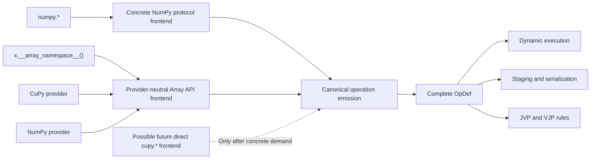

# ADR: Concrete NumPy and provider-neutral Array API frontends

**Date:** 2026-08-01
**Status:** Accepted
**Implementation status:** Complete
**Amends:** [Extensible Autodiff Core Reset](2026-07-21-extensible-autodiff-core.md),
section “Array API core and NumPy frontend”

## Context

Advect has two array entry contracts with different foreign semantics:

- NumPy calls Advect through `__array_ufunc__` and `__array_function__`, with
  NumPy signatures, aliases, weak scalars, ufunc methods, `like=`, `out=`, and
  functionalized mutation;
- provider-neutral programs call the versioned Array API namespace returned by
  `x.__array_namespace__()`.

Both frontends eventually emit the same canonical `array.*`, `array_ext.*`,
and explicit `advect.*` operations. That common endpoint previously motivated
putting the NumPy protocol implementation in backend-neutral
`advect.core._array_protocol_*` modules behind an
`ArrayBackendNamespaceAdapter`.

The abstraction does not represent a real multi-frontend boundary. NumPy is
the only production adapter. Four handler modules retain mutable process-global
backend state, constructing another adapter changes the runtime used by the
first, and the supposedly generic implementation contains explicit NumPy
branches. CuPy does not consume this protocol path: it uses the separate Array
API provider path. Keeping the adapter therefore adds
configuration, factories, fields, branches, and tests without preserving an
actual product contract.

Advect is still greenfield. Private module compatibility does not justify
retaining that machinery, but every qualified public invocation and canonical
operation contract remains protected.

## Decision

Advect has two current array frontends:

1. a concrete NumPy frontend under `advect.numpy` for programs written with
   `numpy.*`;
1. a provider-neutral Array API frontend for programs written through
   `x.__array_namespace__()`.

Each frontend owns its foreign calling convention and binds arguments before
emitting a canonical operation. Sharing begins at canonical operation emission,
not at foreign signature normalization.

### Ownership

`advect.core` owns:

- trace lifetimes and canonical operation recording;
- complete `OpDef` records and registry semantics;
- abstract evaluation, derivatives, staging, serialization, and native
  boundaries;
- stateless helpers with a real core or Array API consumer.

It does not import NumPy, CuPy, `advect.numpy`, frontend release policy, or
foreign NumPy signatures. It has no mutable frontend configuration.

`advect.numpy` owns:

- NumPy protocol dispatch and supported ufunc methods;
- NumPy signature and keyword normalization;
- aliases, composites, constructors, `out=`, and mutation semantics;
- NumPy-only concrete evaluation;
- executable NumPy support evidence.

It does not duplicate canonical abstract or derivative semantics from
`OpDef`.

The Array API frontend continues to own versioned namespace contracts,
provider selection, and provider-neutral calls. It does not inherit NumPy
aliases, ufunc methods, mutation, or weak-scalar policy merely because some
calls lower to the same primitive.

### Staged frontend boundary

The authored frontend remains part of a durable program's execution contract.
Nodes emitted by the NumPy frontend carry a private NumPy tag. Replay checks
that tag against the resolved input namespace before any bound, fallback, or
direct evaluator runs, and rejects a non-NumPy provider with `TypeError`.
Ordinary Python scalars remain valid NumPy operands. Nodes emitted through the
Array API have no NumPy tag and continue to resolve the invocation's provider,
so the same staged program remains portable between qualified Array API
providers. `ArraySpec` and the serialized graph do not gain provider identity.

This boundary applies to transformed and durable programs. An ordinary
untraced `advect.numpy` attribute delegates to NumPy and retains NumPy's own
coercion behavior.

### Private frontend hooks

Core retains a bounded dependency-inversion seam for selecting the
NumPy-capable abstract tracer and for binding NumPy protocols encountered by a
nested Array API trace. Hook names are deterministic import-time state:
registering the identical callable again is harmless, rebinding an occupied
name is rejected, and there is no unregister or reset lifecycle. These hooks
prevent a core-to-frontend import and preserve nested transformations; they are
not a public backend configuration or discovery API.

### Reuse rule

Code remains shared only when it has at least two current consumers with the
same semantics. Expected shared authorities include canonical operation IDs,
complete `OpDef` records, abstract rules, JVPs, VJPs, staging, serialization,
native execution, and stateless operand or attribute helpers used below both
frontends.

NumPy and Array API signature binding, protocol validation, mutation, and
support claims are deliberately separate. A common result operation does not
make those foreign contracts interchangeable.

### Normalization ownership

The normalization review applies the reuse rule one call family at a time.
Required positional binding already has two equal-semantic consumers in
`advect.numpy._signature.normalize_required_positionals`: dynamic
`__array_function__` dispatch and abstract protocol dispatch. NumPy
constructors likewise already converge on `advect.numpy._constructors`, where
the concrete and abstract entry points select the same `array`, `asarray`, and
`asanyarray` implementations. These are the shared authorities; another
wrapper would only add indirection.

Controlled reductions and `out=` remain separate. The dynamic reduction path
operates on concrete traced values, evaluates NumPy composites, and records
result values and node IDs. The abstract path has no payload and instead
derives shape and dtype while emitting canonical graph nodes. Dynamic `out=`
validates and commits against actual destinations and recorder state, whereas
staged `out=` validates representative shape, dtype, and layout before
replacing an abstract cell. A common helper would therefore need callbacks or
metadata for payload access, emission, destination ownership, and commit
behavior. It would encode the lifetime split rather than remove a duplicated
decision.

Linear-algebra mode selection also remains local to the two lifetime owners.
Modes such as `qr(mode="r")` and `svd(compute_uv=False)` select a different
operation and output arity. Canonical output arity is already owned by `OpDef`,
and field-bearing containers are restored by
`advect.core._array_api.results.restore_array_api_result`; neither is duplicate
frontend policy. Extracting only the mode discriminator would require an
operation/mode descriptor plus lifetime branches, recreating the generic
adapter or operation-description language this decision removes. A pure family
normalizer is extracted only when both paths accept the same inputs, produce
the same normalized outputs and errors, and the slice removes more production
decision code than it adds.

### Removed machinery

The implementation removes, without compatibility aliases:

- `ArrayBackendNamespaceAdapter` and `NUMPY_BACKEND_SPEC`;
- mutable `_BACKEND_STATE` objects and `configure_*_backend` functions;
- module-global namespace rebinding;
- one-consumer `build_*_runtime` factories;
- unused adapter fields and speculative non-NumPy branches;
- tests whose only contract is constructing imaginary backend adapters;
- core imports of NumPy release policy.

A concrete NumPy dispatcher or immutable handler mapping remains valid when it
owns real NumPy dispatch behavior. The decision does not require flattening all
control flow into `TracedArray`.

No replacement `FrontendAdapter`, plugin system, configurable namespace
object, or placeholder `advect.cupy` package is introduced. If a second direct
frontend is implemented later, it starts as a concrete implementation; a
helper is extracted only after two current consumers demonstrate identical
semantics.

### CuPy boundary

CuPy remains the designated provider for backend-neutral Array API programs
through the existing compatibility-provider path. Its historical source-only
run does not verify a current pass without retained reports and digests. This
decision does not admit direct `cupy.*` tracing or NumPy-authored programs
operating on CuPy-backed Advect values.

A future direct CuPy frontend, if concrete demand earns it, owns CuPy-specific
dispatch and argument binding and joins Advect at canonical operation emission.
It does not receive a second copy of abstract or derivative semantics.

### Support evidence

Executable handlers remain the authority for NumPy lowering. Executable
invocation cases independently prove advertised lifetimes. The compact installed
NumPy declaration owns the public callable, lifetime, and derivative claim
consumed by the support catalog. Registration or abstract-rule presence alone
cannot promote a callable to dynamic, staged, or serialized support.

Exact bidirectional tests join policy and proof. Removing or changing a required
invocation case fails CI until a maintainer explicitly changes the declaration;
test deletion does not silently demote working support. This data-only evidence
is not a second signature language or a replacement implementation table, and
it does not generate runtime bookkeeping.

## Compatibility

The rewrite preserves qualified public behavior:

- public transforms and custom primitives;
- admitted NumPy values, dtypes, derivatives, mutation, and lifetimes;
- Array API programs and qualified providers;
- canonical operation IDs and current serialized program semantics.

Preserving the qualified, version-selected NumPy array-function handler surface
is an explicit breadth decision. Once a handler has working executable
evidence, line reduction must come from duplicated machinery rather than
deleting that numerical surface.

Intentional visible corrections are allowed:

- support catalog and generated documentation become fail-closed;
- a broken or unqualified form is fixed, demoted, or removed instead of being
  advertised;
- private `_array_protocol_*`, adapter, builder, and configuration imports
  disappear;
- accidental direct `cupy.*` and NumPy-on-CuPy behavior remains unsupported;
- internal exception paths and wording may change.

Advect provides no private compatibility aliases for the previous ownership
layout.

## Implementation and acceptance

The migration order is:

1. make NumPy support evidence fail closed and complete staged conformance;
1. capture an exact reference Advect artifact and regression evidence;
1. move NumPy foreign-contract code under `advect.numpy` mechanically;
1. replace adapter access with direct NumPy ownership;
1. delete configuration, factories, speculative branches, and adapter-only
   tests;
1. consolidate helpers only after behavior remains qualified.

Acceptance requires:

- no NumPy, CuPy, `advect.numpy`, or frontend release-policy import from
  `advect.core`;
- no backend adapter or mutable backend configuration;
- NumPy and Array API meeting only at canonical emission and shared semantic
  authorities below it;
- unchanged qualified public behavior except explicit support corrections;
- CuPy remaining on the designated Array API provider path;
- no material regression against reference Advect;
- net-negative installed runtime code;
- a non-positive combined production-code delta for the frontend
  boundary, canonical-identity, and normalization cleanup;
- transparent whole-repository accounting without using test or behavior
  deletion to force an aggregate line target;
- applicable default, thorough, NumPy-version, provider, native, docs,
  Pyodide, wheel, and artifact gates passing.

## Consequences

The package has a more honest dependency graph: NumPy implementation details
live in the NumPy frontend, while the stdlib-only core retains only semantic
and lifetime machinery shared by real consumers. The current product loses no
qualified provider path.

Adding a direct frontend later requires concrete dispatch code and evidence
rather than filling adapter fields. Some NumPy implementation files may remain
large because NumPy itself has a broad foreign contract; the goal is fewer
authorities and less machinery, not smaller files produced by indirection.
